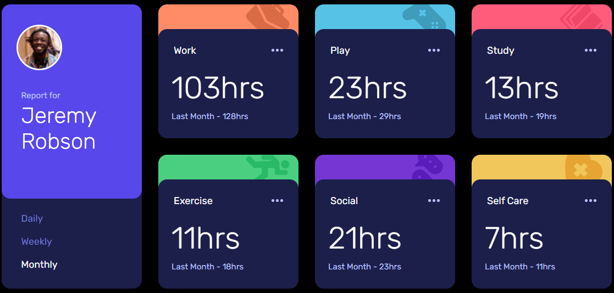
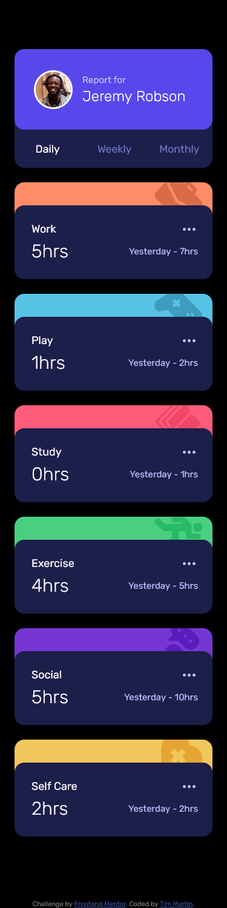

# Frontend Mentor - Time tracking dashboard solution

This is a solution to the [Time tracking dashboard challenge on Frontend Mentor](https://www.frontendmentor.io/challenges/time-tracking-dashboard-UIQ7167Jw). Frontend Mentor challenges help you improve your coding skills by building realistic projects. 

## Table of contents

- [Overview](#overview)
  - [The challenge](#the-challenge)
  - [Screenshot](#screenshot)
  - [Links](#links)
- [My process](#my-process)
  - [Built with](#built-with)
  - [What I learned](#what-i-learned)
  - [Continued development](#continued-development)
  - [Useful resources](#useful-resources)
- [Author](#author)

## Overview

### The challenge

Users should be able to:

- View the optimal layout for the site depending on their device's screen size
- See hover states for all interactive elements on the page
- Switch between viewing Daily, Weekly, and Monthly stats

### Screenshot



 

### Links

- Solution URL: [Frontend Mentor](https://www.frontendmentor.io/solutions/scss-javascript-html-qo2zJ3MxFo)
- Live Site URL: [Github pages](https://timmartin13-frontend-mentor.github.io/time_tracking_dashboard/)

## My process

### Built with

- Semantic HTML5 markup
- SCSS
- Flexbox
- Mobile-first workflow
- JavaScript


### What I learned

I am learning about how to breakdown my scss into smaller files to make them easier to read. That way the main.scss has almost nothing in it.

To see how you can add code snippets, see below:

```css
// Abstracts
@import "./abstracts/__abstracts-dir";
// Base Styles
@import "./base/__base-dir";
// Card layout
@import "./layout/__layout-dir";
// Components
@import "./components/__components-dir";


body {
  background-color: black;
}
```

### Continued development

I am going to continue to focus on breaking up my css into smaller, workable files while I move on to refreshing my skills in JavaScript and React.


### Useful resources

- [Flexbox](https://css-tricks.com/snippets/css/a-guide-to-flexbox/) - I use this for every project
- [SCSS Architecture](https://matthewelsom.com/blog/simple-scss-playbook.html) - I found this to be the resource that I used the most when breaking up my SCSS

## Author

- Website - [My portfolio](https://timmartin13.github.io/react-portfolio/)
- Frontend Mentor - [@TimMartin13](https://www.frontendmentor.io/profile/TimMartin13)

